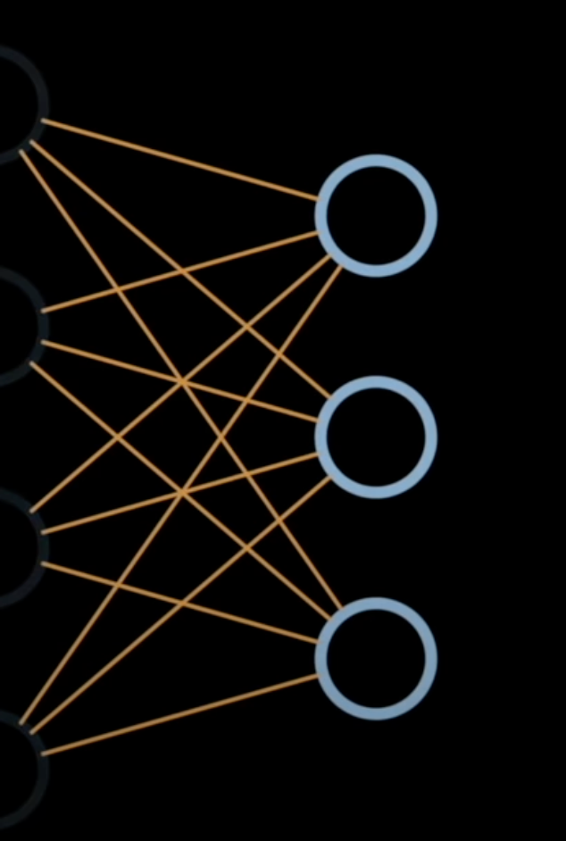
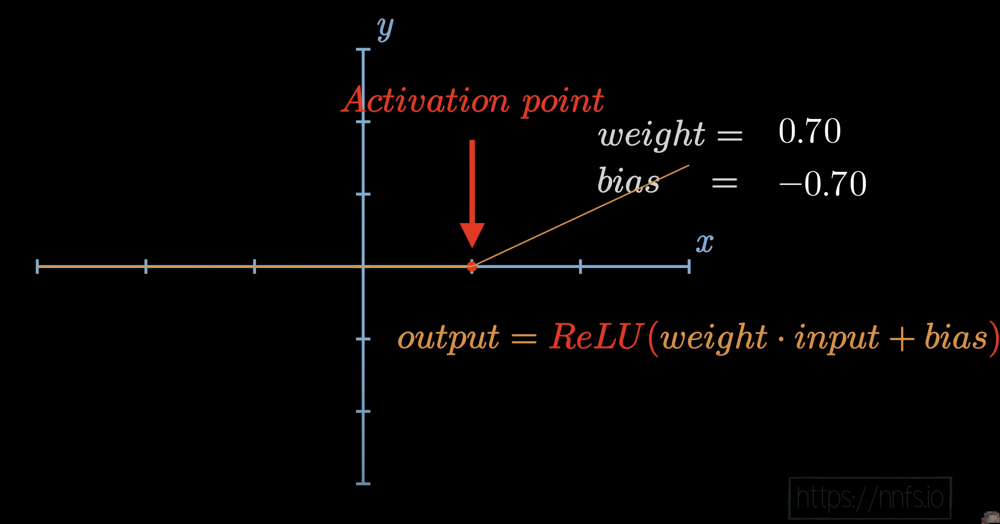

# Single Layer, Multiple Neuron

## taking our equation as graph
### look as following graphs below. we can map it to the equation y = mx + c. where m is the weight, x is the input and c is the bias

### ReLU and activation point
