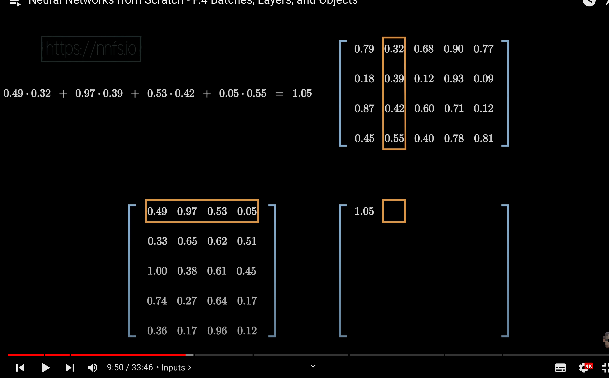
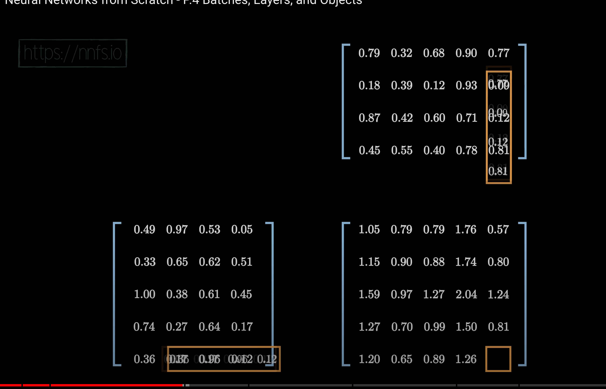
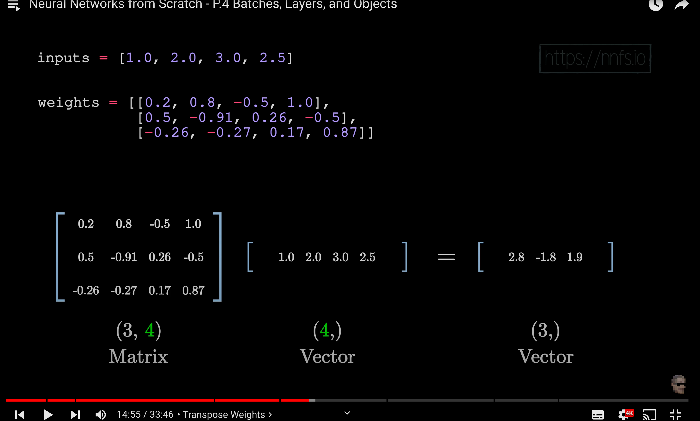

# 3. Batches, Layers and Objects
## Matrix input 
### if input is MxN array, then weights should be NxM array

## programs
### 1. Matrix(2D) Input with single later
### 2. Better approach for 1
    - We Normalize input data before performing operation