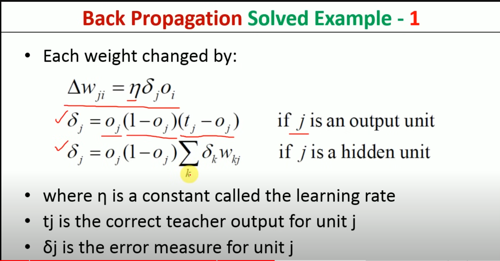
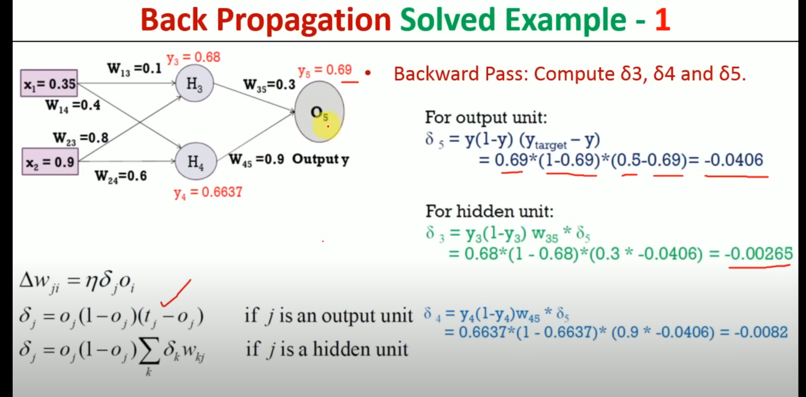

# Back Propogation
Back propogation is used to update weights and bias
<a href="https://www.youtube.com/watch?v=tIeHLnjs5U8">youtube</a>
### Consider the case of where we have multiple layers with single neuron

#### activation function
represented as a(L) for last neuron, a(L-1) for second last neuro, and so on

#### desired output
the desired output is represented as y

#### cost (Co)
the cost is the square of difference of actual output a(L) and Desired output y
(a(L) - y)2

### Derivation
from the above details we can define following

from the chain rule we can say that

Now substituting values from the defined eequations and applying derivative to it we get followin equations on the left of following image

now substituting these values to equation that we derived using chain rule we get

#### We can do the same to find difference in bias, activation
for bias

for activation

### Considering case of multiple neuron in single layer and applying the above equation we get
for activation function

for weight

## final algorithm

## solved problem
